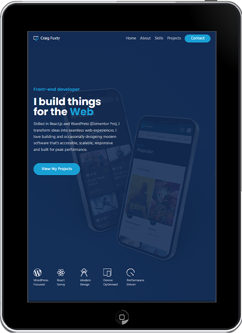

# Portfolio.v3

A clean, responsive single page application that offers a concise snapshot of who I am, what I do, and how I work. Built to showcase my skills, reflect my journey, and serve as a central hub for potential clients and collaborators.

This project reflects my commitment to writing clean, scalable code and building thoughtful, user focused digital experiences.

## Design

The goal was to create a modern, elegant design with smooth transitions and a layout that’s easy to navigate for both technical and non technical users.

## Features

- Single page application (SPA)
- Responsive layout and optimised images
- Custom SVG icons
- Mobile friendly toggle menu
- Smooth scroll navigation
- GSAP animation and scroll triggers
- Toast notifications for form status
- Tooltips for icon context
- Functional contact form using EmailJS

## Project Focus

This project gave me the chance to put several established skills into practice, including working with TypeScript in a React environment and applying GSAP for smooth, performant animation. It also helped me refine my approach to structure, responsiveness and creating a polished user experience.

## Core Technologies

- HTML5
- Sass / Scss
- TypeScript
- React

## Third Party Tools

- React icons
- React router
- Gsap
- EmailJS

## Design tools

- Adobe Photoshop
- Adobe Illustrator

## Live Site

[www.craigpuxty.dev](https://craigpuxty.dev/)
